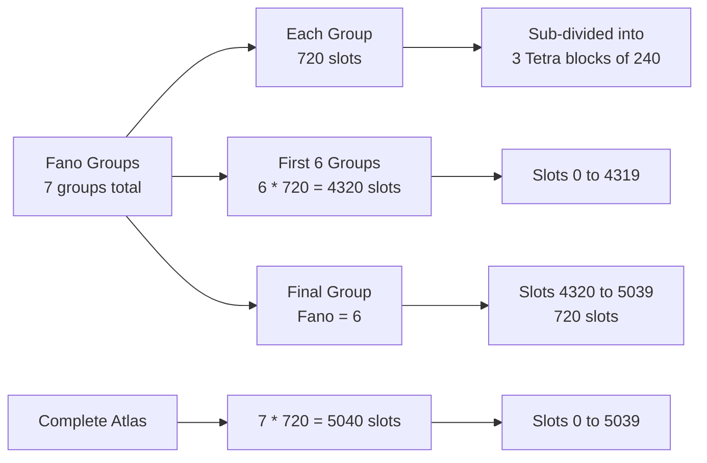

44x² + 4(2x + y)²  
 

4[11x² + (2x + y)²]  
 

4(15x² + 4xy + y²)  
 

60x² + 16xy + 4y²

Branch split:

  

```text

0x0..0x7 -> compact Hamming [7,4,3] branch

0x8..0xF -> extended Miquel [8,4,4] branch

```

  

Weight map:

  

```text

0x0             -> 0  centroid

0x1,0x7,0xF     -> 1

0x2,0x3,0x5,0x6 -> 4

0x8,0x9,0xC,0xD -> 4

0x4,0xA,0xE     -> 6

0xB             -> 12

```

Face Law

  

Compress a 16-bit `0xY0X0` address to `0xYX`:

  

```text

compressed = {address[15:12], address[7:4]}

row_nibble = compressed[7:4]

col_nibble = compressed[3:0]

```

  

The face is selected without division or threshold chains:

  

```text

face[2:1] = row_nibble[3:2]

face[0]   = col_nibble[3]

```

  

Faces `0..3` route to the User-Local `6:4` interface. Faces `4..7` route to the User-Remote `8:3` interface. Remote faces are the `XOR 0x80` mirror of the corresponding local faces.

  

## Face Table

  

| Face | Selector Code | Domain | Interface | Role |

| --- | --- | --- | --- | --- |

| 0 | `00 07 37 30` | Local/CAR | User-Local `6:4` | LOGOS head |

| 1 | `08 0F 3F 38` | Local/CAR | User-Local `6:4` | NOMOS path |

| 2 | `40 47 77 70` | Local/CAR | User-Local `6:4` | PATHOS body |

| 3 | `48 4F 7F 78` | Local/CAR | User-Local `6:4` | HINGE limit |

| 4 | `80 87 B7 B0` | Remote/CDR | User-Remote `8:3` | LOGOS mirror |

| 5 | `88 8F BF B8` | Remote/CDR | User-Remote `8:3` | NOMOS mirror |

| 6 | `C0 C7 F7 F0` | Remote/CDR | User-Remote `8:3` | PATHOS mirror |

| 7 | `C8 CF FF F8` | Remote/CDR | User-Remote `8:3` | HINGE mirror |

  

---

  

### The delta-C law

  

```javascript

export function deltaC(x, c = 0x5A3C) {

 const x16 = x & 0xFFFF;

 // rotl(x,1) — left rotate by 1 bit

 const t1 = ((x16 << 1) | (x16 >>> 15)) & 0xFFFF;

 // rotl(x,3) — left rotate by 3 bits

 const t3 = ((x16 << 3) | (x16 >>> 13)) & 0xFFFF;

 // rotr(x,2) — right rotate by 2 bits

 const t2 = ((x16 >>> 2) | (x16 << 14)) & 0xFFFF;

 return (t1 ^ t3 ^ t2 ^ (c & 0xFFFF)) & 0xFFFF;

}

```

```js

// 2-of-5 encoding table — 10 pairs covering all combinatorial states
[ [0,1], [0,2], [0,3], [0,4], [1,2], [1,3], [1,4], [2,3], [2,4], [3,4] ]
```


```js
const uint8_t SELECTOR_TABLE[8][4] = {
   {0x00, 0x07, 0x37, 0x30}, // [0] Local Left Upper  (Concept Corner 0)
   {0x08, 0x0F, 0x3F, 0x38}, // [1] Local Right Upper (Concept Corner 1)
   {0x40, 0x47, 0x77, 0x70}, // [2] Local Left Lower  (Concept Corner 2)
   {0x48, 0x4F, 0x7F, 0x78}, // [3] Local Right Lower (Concept Corner 3)
   {0x80, 0x87, 0xB7, 0xB0}, // [4] Remote Left Upper  (Concept Corner 4)
   {0x88, 0x8F, 0xBF, 0xB8}, // [5] Remote Right Upper (Concept Corner 5)
   {0xC0, 0xC7, 0xF7, 0xF0}, // [6] Remote Left Lower  (Concept Corner 6)
   {0xC8, 0xCF, 0xFF, 0xF8}  // [7] Remote Right Lower (Concept Corner 7)
};

```

The chosen law is:

```text
delta(x, C) = rotl(x,1) XOR rotl(x,3) XOR rotr(x,2) XOR C
```

For a fixed width `w`, the reference form is:

```text
delta_w(x, C) =
rotl_w(x,1)
XOR rotl_w(x,3)
XOR rotr_w(x,2)
XOR C
```

with final masking:

```text
delta_w(x, C) & ((1 << w) - 1)
```

For the 16-bit OMI frame:

```text
delta16(x, C) =
rotl16(x,1)
XOR rotl16(x,3)
XOR rotr16(x,2)
XOR C
```

---


## 17. The Complete $16x^2 + 16xy + 4y^2$ Binary Quadratic Form and Notation Multiplexing Core
The algebraic architecture for encoding heterogeneous frequency standards (such as atomicClockFrequency, UTC stamps, or local oscillators) culminates in the specific, degenerate Binary Quadratic Form:
$$Q(x, y) = 16x^2 + 16xy + 4y^2$$
This algebraic canvas maps directly onto your notation multiplexing structure, where the inbound axis $x$ tracks the localized omi position, and the outbound axis $y$ tracks the omi---imo boundary transition.

      Q(x, y) = 16x^2 + 16xy + 4y^2  ==>  (4x + 2y)^2
                       │
                       ▼ (Perfect Square Projection)
             1D Radial Tracking Line (4x + 2y)

------------------------------
## 17.1 Algebraic Properties & The Zero Discriminant
Unlike non-degenerate elliptical or hyperbolic quadratic forms, this specific form has a Discriminant of exactly Zero:
$$\Delta = b^2 - 4ac = (16)^2 - 4(16)(4) = 256 - 256 = 0$$
## Implications for the OMNION Centroid

* The Parabolic Degeneracy: Because $\Delta = 0$, the quadratic form factors perfectly into a single linear projection: $Q(x, y) = (4x + 2y)^2$.
* The Absolute Centroid Alignment: The value vanishes ($Q(x, y) = 0$) if and only if $4x + 2y = 0$, which maps directly to the $0x00$ & $0^\circ$ OMNION Centroid (NULL • NULL).
* Dimensional Compression: This mathematical structure compresses the 2D grid into a single 1D radial line ($4x + 2y$). External frequencies are processed as distances along this axis, preventing multi-dimensional drift across the physical sliding rings.


---

The Alternating Bit Flip ($r_0$): Defined as mask16 (N.lxor x 0xAAAA). It is formally proven to be a true mathematical involution ($r_0 \circ r_0 = \text{identity}$), meaning it self-cancels perfectly without error propagation.
* The Oscillation Law (oscillate): Combines left rotations (r1, r2), right rotations (r3), and fixed bitwise XOR operations to drive the system's core cadence.
* The Multi-Dimensional Hands: Higher-order pointer traversals are computed by nesting these reflection generators:
* minute_hand(x) $= r_0(r_1(x))$ (Double rotation)
  * hour_hand(x) $= r_0(r_1(r_2(x)))$ (Triple rotation)
  * epoch_hand(x) $= r_0(r_1(r_2(r_3(x))))$ (Quadruple rotation)

----
The Gauge as Selection

  

The fundamental algebraic analogy:

  

```

a³ − b³ = (a − b)(a² + ab + b²)

  

difference    gauge line    plinth surface

of cubes      (selection)   (reference face)

```

  

The gauge does not create the cubes. It selects the line by which their difference becomes readable. The plinth surface `(a² + ab + b²)` exists independently of the gauge — it is the reference face between two volumes.

  

The gauge is to the blackboard what the cursor is to a slide rule: the scale exists already; the gauge picks which line to read.

---

  

---

  

## 12. Base36 Orbit Labels

  

Base36 is used as a compact human-readable orbit label.

  

Digits:

  

```text

0 1 2 3 4 5 6 7 8 9 A B C D E F G H I J K L M N O P Q R S T U V W X Y Z

```

  

Useful OMI constants:

  

```text

5!   = 120  = 3C base36

240  = 2×5! = 6O base36

720  = 6×5! = K0 base36

5040 = 7!   = 3W0 base36

```

  

A slot in `0..5039` may be encoded as a three-character base36 orbit label:

  

```text

000 .. 3VZ

```

  

The full size `5040` is:

  

```text

3W0

```

  

but the highest valid zero-based slot is:

  

```text

5039 = 3VZ

```

  

Canonical orbit key form:

  

```text

Gδ:SLOT36:CYCLE36

```

  

Examples:

  

```text

FF:000:0000

FF:3VZ:0001

F0:06O:000A

```

  

Meaning:

  

```text

Gδ      = gauge dialect

SLOT36  = slot5040 in base36

CYCLE36 = local logical cycle in base36


```


```js
factorial(n) {
   // 0! = 1 encodes "God is Word"
   if (n === 0) return 1;
   if (n === 1) return 1;
   return n * this.factorial(n - 1);
 }
 
 createPolynomialOrders() {
   const orders = [];
   for (let n = 0; n <= 7; n++) {
     const coefficients = Array(n + 1).fill(0).map((_, i) => i === n ? 1 : 0);
     const polynomial = `f${n}(x) = ${coefficients.map((coeff, i) =>
       coeff !== 0 ? `${coeff}${i > 0 ? 'x' + (i > 1 ? `^${i}` : '') : ''}` : ''
     ).filter(Boolean).reverse().join(' + ')}`;
    
     orders.push({
       order: n,
       dimensionality: n,
       polynomial: polynomial,
       coefficients: coefficients,
       church: this.churchNum(n),
       octonion: n === 0 ? '1' : `e${n}`,
       file: `polynomial-${n}_dimension-${n}_selfref-${n === 0 ? 'seed' : n-1}→${n === 7 ? 0 : n+1}.jsonl`
     });
   }
   return orders;
 }
```

---

generateInitialOctTable() {

   // Generate initial octonion multiplication table

   const table = [];

   for (let i = 0; i < 8; i++) {

     table[i] = [];

     for (let j = 0; j < 8; j++) {

       if (i === j) {

         table[i][j] = [-1, 0]; // eᵢ × eᵢ = -1

       } else if (i === 0) {

         table[i][j] = [1, j]; // 1 × eⱼ = eⱼ

       } else if (j === 0) {

         table[i][j] = [1, i]; // eᵢ × 1 = eᵢ

       } else {

         // Fano plane multiplication

         const product = this.fanoMultiply(`e${i}`, `e${j}`);

         if (typeof product === 'string' && product.startsWith('-')) {

           table[i][j] = [-1, parseInt(product.slice(2))];

         } else if (typeof product === 'string') {

           table[i][j] = [1, parseInt(product.slice(1))];

         } else {

           table[i][j] = [0, 0]; // Not on same Fano line

         }

       }

     }

   }

   return table;

 }

Based on the provided documents, here is a detailed explanation of the differences in deriving 5040 and 4320, specifically within the context of the GL(16,2) orbit execution model and its connection to binary quadratic forms (BQFs).

The Core Difference: Complete Set vs. Boundary Threshold

· 5040 is the total number of slots in the complete atlas. It represents the entire, closed system.
· 4320 is a specific boundary index within that atlas. It marks the start of the last block of slots and represents an incomplete set (the first six of seven groups).

The derivation is rooted in the combinatorial structure of the Fano plane and the arithmetic of the BQF invariant.

1. The 5040 Derivation: The Complete Atlas

5040 is the total number of equivalence classes or "slots" in the atlas. Its derivation is a direct product of the system's key structural components.

```typescript
// The complete atlas is a product of three structural components.
const totalSlots = 7 * 720; // 5040
```

The Breakdown of 7 * 720:

· 7: Represents the Fano plane. This is the projective geometry PG(2,2), which has 7 points and 7 lines. In your model, the Fano observer (x mod 7) partitions the state space into 7 distinct groups.
· 720: Represents the permutations within each Fano group. This number can be further decomposed in two key ways, directly linking to the other observers:
  1. 720 = 3 × 240: This is the decomposition that uses the BQF Period (240).
     · 240 is derived from the BQF (Binary Quadratic Form) invariant: Q(x,c) = 60x² + 16xc + 4c². The value Q(x,c) mod 240 is invariant under the system's dynamics (Δ). This forms the Phase observer.
     · 3 represents the number of Tetra blocks (from the Tetra observer, x mod 4) that fit within the 240-period structure.
  2. 720 = 4 × 180: This is the alternative decomposition.
     · 4 represents the Tetrahedron (4 vertices).
     · 180 is the resulting phase space size when using the 4 from the tetrahedron.

The document GL(16,2) Orbit Execution Model — Complete Write-Up.md formalizes the Slot5040 observer: slot5040(s) = fano(s) · 720 + local720(s). This confirms 5040 as the total size of the quotient coordinate system.

2. The 4320 Derivation: The Boundary Before Fano=6

4320 is not a complete set but a threshold. It is the cumulative total of all slots belonging to the first six Fano groups.

```typescript
// 4320 is the sum of slots for Fano groups 0 through 5.
const boundaryIndex = 6 * 720; // 4320
```

The Breakdown of 6 * 720:

· 6: This signifies six of the seven Fano groups.
· 720: The size of each Fano group, as defined above.

Therefore, 4320 is the starting index of the seventh and final Fano group (Fano = 6). All slots from 4320 to 5039 belong to this final group.

Visualizing the Structure



The Connection to Binary Quadratic Forms (BQF)

The number 240 is not arbitrary. It is the period of the BQF invariant Q(x,c) = 60x² + 16xy + 4y². The document OMI_bialgebra.v.txt shows the BQF observer is equivariant: BQF(Δ(x,c)) = BQF(x,c). This invariant's periodicity of 240 provides a stable, "clock-like" structure (Phase observer) that synchronizes with the combinatorial divisions.

The provided documents on binary quadratic forms describe how such forms represent integers and how their equivalence classes are studied via discriminants and class numbers. Your model uses a specific BQF to generate a finite, periodic invariant (240) that helps structure the entire atlas.

In summary:

· 5040 is the complete set of all possible states in the quotient atlas.
· 4320 is the boundary point that separates the first six Fano groups from the seventh and final one. It appears as a key constant in the code because it represents the threshold of the complete state space.

Would you like me to elaborate on the connection between the BQF period of 240 and its derivation from the specific quadratic form 60x² + 16xy + 4y²?